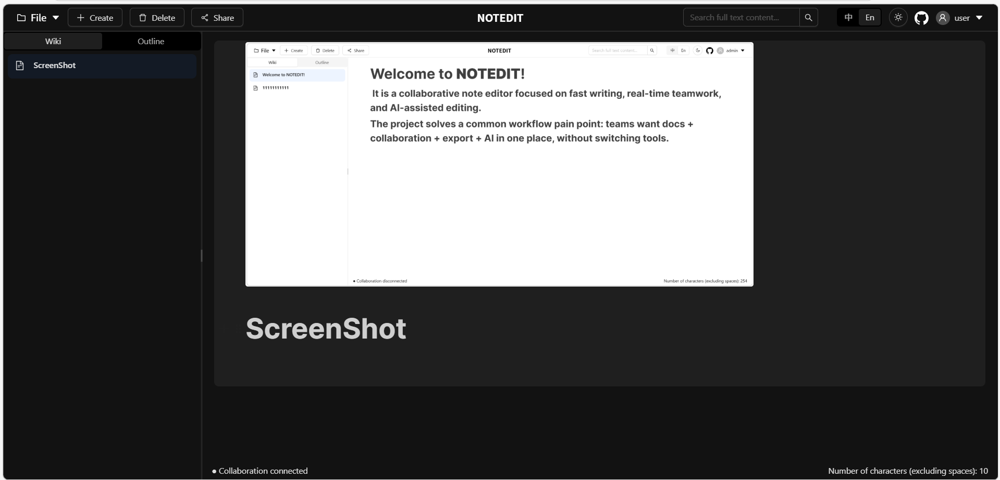

<div align="center"><a name="readme-top"></a>

[![][image-banner]][project-link]

# NOTEDIT

AI-powered collaborative note editor for teams and individuals.<br/>
Built with BlockNote, Yjs/Hocuspocus, React, and Express.

**English** · [简体中文](./README.zh-CN.md) · [文档][docs-link] · [反馈][issues-link]

<!-- TECH STACK CARD -->
<p align="center">
  
</p>
<p align="center">
  
  
  
  
</p>

<sup>Write together, think faster.</sup>

</div>

---

<details>
<summary><kbd>Table of contents</kbd></summary>

####

- [Features](#-features)
- [Quick Start](#-quick-start)
- [Local Development](#️-local-development)
- [Contributing](#-contributing)
- [License](#-license)

</details>

---

## Getting Started

Welcome to **NOTEDIT**! It is a collaborative note editor focused on fast writing, real-time teamwork, and AI-assisted editing.

The project solves a common workflow pain point: teams want docs + collaboration + export + AI in one place, without switching tools.

> [!IMPORTANT]
>
> **Star Us** - Your support helps us continue improving!

<div align="center">
  <picture>
    <!-- 替换为你的项目截图 -->
    
  </picture>
</div>

![Product Screenshot 2][image-screenshot-2]
![Product Screenshot 3][image-screenshot-3]

---

## Features

### Real-time Collaboration with Yjs + Hocuspocus

Edit the same document together in real time. Presence status and conflict-free synchronization are powered by Yjs + Hocuspocus.

<!-- 替换为协作功能演示图 -->

![Feature Demo][image-feature-realtime]
![Feature Demo 2][image-feature-realtime-2]

<div align="right">

[![][back-to-top]](#readme-top)

</div>

---

### AI-powered Writing Assistance

Integrated AI chat and editing flow with streaming output. Great for drafting, rewriting, summarizing, and structured document refinement.

<!-- 替换为AI功能演示图 -->

![Feature Demo][image-feature-ai]
![Feature Demo 2][image-feature-ai-2]
![Feature Demo 3][image-feature-ai-3]
![Feature Demo 4][image-feature-ai-4]

> [!TIP]
>
> **Pro tip**: Combine AI suggestions with collaboration mode for rapid team iteration.

<div align="right">

[![][back-to-top]](#readme-top)

</div>

---

### Rich Editing + Export + Sharing

Use a modern rich-text editor, upload images, export to Markdown/PDF/DOCX, and generate share links for teammates.

```ts
// Example idea: collaboration hook usage
const { editor, status } = useCollaboration({
  docId,
  userName: user?.username,
  userColor: "#1971c2",
});
```

<!-- 替换为编辑/导出功能演示图 -->

![Feature Demo][image-feature-export]
![Feature Demo 2][image-feature-export-2]

<div align="right">

[![][back-to-top]](#readme-top)

</div>

---

## Quick Start

### Prerequisites

- Node.js 20+
- pnpm 10+
- MongoDB (local or cloud)

### 1) Install dependencies

From repository root:

```bash
pnpm install
```

### 2) Configure environment variables

Create `web/server/.env` (you can copy from `web/server/.env.example`) and fill in values:

```env
MONGODB_URI=
PORT=3001
JWT_SECRET=
ALIBABA_CLOUD_API_KEY=
ALIBABA_CLOUD_BASE_URL=
ALIBABA_CLOUD_MODEL_NAME=
CLIENT_ORIGIN=http://localhost:5173
```

Optional client variable:

```env
VITE_COLLAB_WS_URL=ws://localhost:3001
```

### 3) Start backend

```bash
cd web/server
pnpm dev
```

### 4) Start frontend

```bash
cd web/client
pnpm dev
```

Frontend default: `http://localhost:5173`  
Backend default: `http://localhost:3001`

---

## Local Development

### Project structure

```
web/
├── client/          # React + Vite frontend
├── server/          # Express API + Hocuspocus collaboration server
└── server/uploads/  # uploaded files
```

### Main routes

- Frontend: `/login`, `/wiki`, `/wiki/:docId`
- Backend: `/api/auth`, `/api/documents`, `/api/uploads`, `/health`
- WebSocket: `/`, `/collaboration`, `/collaboration/:documentName`

### Tech stack

| Category      | Technologies                                               |
| ------------- | ---------------------------------------------------------- |
| Frontend      | React 19, TypeScript, Vite, Ant Design, BlockNote, i18next |
| Collaboration | Yjs, Hocuspocus                                            |
| Backend       | Express 5, TypeScript, Mongoose, JWT, Multer               |
| AI            | AI SDK + OpenAI-compatible provider (Qwen/Alibaba Cloud)   |

---

## Contributing

Contributions, issues, and feature requests are welcome!

1. Fork the repo
2. Create your feature branch
3. Commit your changes
4. Open a PR

Please keep PRs focused and include clear reproduction steps for bug fixes.

---

## License

ISC © NOTEDIT

---

<div align="center">
  <sub>
    If this project helped you, please give it a star.
  </sub>
</div>

[![][back-to-top]](#readme-top)

[project-link]: https://github.com/yangling-happy/notedit-hub
[docs-link]: https://github.com/yangling-happy/notedit-hub#readme
[issues-link]: https://github.com/yangling-happy/notedit-hub/issues
[image-banner]: ./web/images/image-banner.png
[image-screenshot-2]: ./web/images/NOTEDIT_Screenshot2.png
[image-screenshot-3]: ./web/images/NOTEDIT_Screenshot3.png
[image-feature-realtime]: ./web/images/Realtime+Collaboration1.png
[image-feature-realtime-2]: ./web/images/Realtime+Collaboration2.png
[image-feature-ai]: ./web/images/AI+Assistant1.png
[image-feature-ai-2]: ./web/images/AI+Assistant2.png
[image-feature-ai-3]: ./web/images/AI+Assistant3.png
[image-feature-ai-4]: ./web/images/AI+Assistant4.png
[image-feature-export]: ./web/images/Export1.png
[image-feature-export-2]: ./web/images/Export2.png
[back-to-top]: https://img.shields.io/badge/-BACK_TO_TOP-151515?style=flat-square
